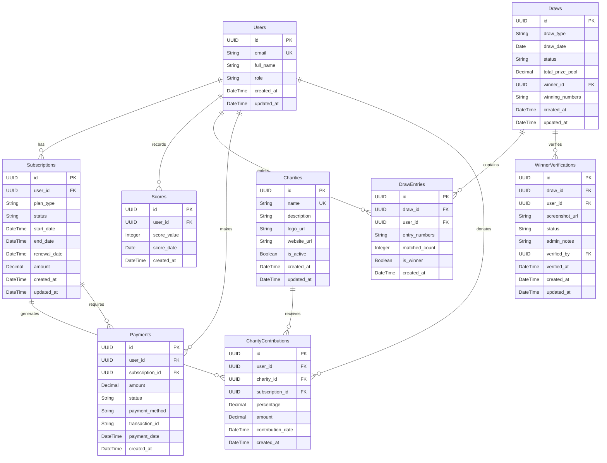

# GolfPro - Charity Impact Platform

A premium golf tracking platform that combines subscription management, prize draws, and charitable giving. Built with React and Node.js, this application helps golfers track their performance while contributing to meaningful causes.

## Architecture Diagram

```
┌───────────────────────────────────────────────────────────────────┐
│                                                                   │
│  ┌─────────────┐      ┌─────────────┐      ┌─────────────┐      │
│  │             │      │             │      │             │      │
│  │  Front-end  │      │  Back-end   │      │  Database   │      │
│  │             │      │             │      │             │      │
│  │   ReactJS   │◄────►│   NodeJS    │◄────►│  Supabase   │      │
│  │             │      │             │      │             │      │
│  │UI Components│      │  ExpressJS  │      │ PostgreSQL  │      │
│  │             │      │             │      │             │      │
│  │ API calls   │      │API endpoints│      │   Tables    │      │
│  │             │      │             │      │             │      │
│  └─────────────┘      └─────────────┘      └─────────────┘      │
│                                                                   │
└───────────────────────────────────────────────────────────────────┘
```

## Database Schema



## What This Project Does

GolfPro is a comprehensive platform for golf enthusiasts that combines performance tracking with charitable giving. Subscribers can track their golf scores, participate in monthly prize draws, and contribute a portion of their subscription fees to charities of their choice.

## Main Features

### For Subscribers
- Create account with email authentication
- Choose monthly or yearly subscription plans
- Track golf scores in Stableford format
- Automatic draw entry based on last 5 scores
- Participate in 3-match, 4-match, and 5-match draws
- Select charity and contribution percentage
- View contribution history and impact
- Submit winner verification with screenshots
- Track draw entries and results
- View personal dashboard with statistics

### For Admins
- Manage user accounts and roles
- Create and schedule prize draws
- Execute draws with automated winner selection
- Review and verify winner submissions
- Manage charity organizations
- View platform statistics and analytics
- Monitor subscription status
- Track prize pool distributions
- Generate reports on contributions

### Draw System
- Three draw types: 3-match, 4-match, 5-match
- Automated entry using last 5 scores
- Random number generation for draws
- Automatic winner selection based on matches
- Prize pool calculation based on active subscribers
- Winner verification workflow
- Tie-breaking mechanism

### Charity Integration
- Multiple charity options
- Customizable contribution percentage (10-100%)
- Automatic contribution calculation
- Contribution tracking and history
- Charity statistics and impact metrics

## Technology Stack

### Frontend
- React 18
- React Router for navigation
- Axios for API calls
- Context API for authentication
- CSS for styling

### Backend
- Node.js with Express
- Supabase for database and authentication
- JWT for session management
- Express Validator for input validation
- Helmet for security
- Morgan for logging
- Compression for performance

### Database
- PostgreSQL via Supabase
- Row Level Security policies
- Automated triggers for timestamps
- Foreign key constraints
- Unique constraints for data integrity

## Development

### Backend Development

```bash
cd backend
npm install
npm start
```

Server runs on http://localhost:5001

### Frontend Development

```bash
cd frontend
npm install
npm start
```

App runs on http://localhost:3000

### Environment Variables

Backend (.env):
```
PORT=5001
NODE_ENV=development
SUPABASE_URL=your_supabase_url
SUPABASE_SERVICE_KEY=your_service_key
SUPABASE_ANON_KEY=your_anon_key
JWT_SECRET=your_jwt_secret
JWT_EXPIRE=7d
FRONTEND_URL=http://localhost:3000
```

Frontend (.env):
```
REACT_APP_API_URL=http://localhost:5001/api
```

### Database Setup

1. Create Supabase project
2. Run schema.sql in SQL Editor
3. Update backend .env with credentials
4. Tables and policies will be created automatically

## API Endpoints

### Authentication
- POST /api/auth/register - Register new user
- POST /api/auth/login - Login user

### Users
- GET /api/users/me - Get current user profile
- PUT /api/users/me - Update user profile
- GET /api/users/dashboard - Get dashboard data

### Subscriptions
- GET /api/subscriptions/me - Get active subscription
- POST /api/subscriptions - Create new subscription
- POST /api/subscriptions/cancel - Cancel subscription

### Scores
- GET /api/scores - Get all user scores
- POST /api/scores - Add new score

### Draws
- GET /api/draws - Get all draws
- POST /api/draws/enter/:drawId - Enter a draw

### Charities
- GET /api/charities - Get all active charities

### Admin
- GET /api/admin/users - Get all users
- PUT /api/admin/users/:userId/role - Update user role
- POST /api/admin/draws - Create new draw
- POST /api/admin/draws/:drawId/execute - Execute draw
- GET /api/admin/verifications - Get pending verifications
- PUT /api/admin/verifications/:id - Approve/reject verification
- POST /api/admin/charities - Add new charity
- GET /api/admin/stats - Get platform statistics

## Security Features

- JWT-based authentication
- Password hashing via Supabase Auth
- Row Level Security policies
- CORS protection
- Helmet security headers
- Input validation on all endpoints
- Role-based access control
- Secure environment variables

## Deployment

### Vercel पर Deploy करना

इस project को Vercel पर deploy करने के लिए detailed guide देखें: [DEPLOYMENT.md](./DEPLOYMENT.md)

#### Quick Deploy Steps:

1. **Vercel CLI Install करें**:
```bash
npm install -g vercel
```

2. **Deploy Script Run करें**:
```bash
./deploy.sh
```

या manually:
```bash
vercel          # Preview deployment
vercel --prod   # Production deployment
```

3. **Environment Variables Set करें** Vercel Dashboard में:
   - Backend: `SUPABASE_URL`, `SUPABASE_SERVICE_KEY`, `JWT_SECRET`, etc.
   - Frontend: `REACT_APP_API_URL`

4. **Verify Deployment**:
   - Frontend: https://your-app.vercel.app
   - Backend API: https://your-app.vercel.app/api/charities

पूरी deployment guide के लिए [DEPLOYMENT.md](./DEPLOYMENT.md) देखें।

## Author

Devendra Mishra  
GitHub: [@Mishra-coder](https://github.com/Mishra-coder)

---

Built with ❤️ for golf enthusiasts and charitable causes
